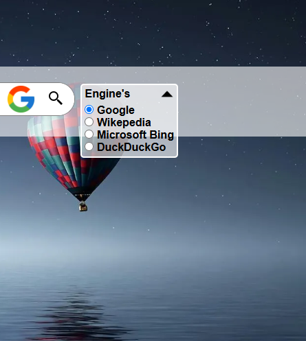
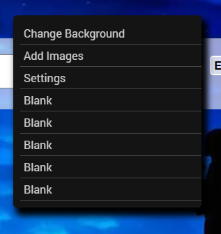
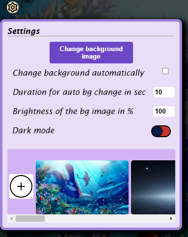
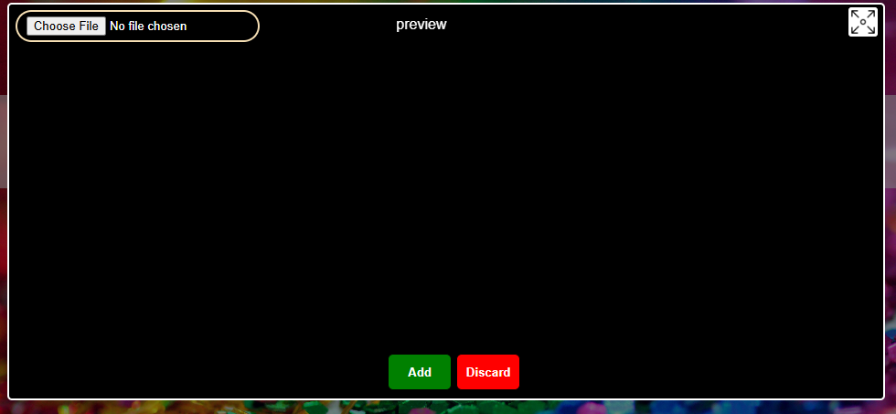

All the clarification for the materials used to make up the page and the resources 
they does not belong to me credits to their owners's.
most of the icons are used from the icons8 website (downloaded) link:[icons8](https://icons8.com/icons).
The photos that are displayed as the background are downloaded from the wallpaperaccess website [wallpaperaccess](https://wallpaperaccess.com/),

About the page that iam building:

I am just making it for fun i guess.
The page does not have much features for now 😏.
The javascript code have been refactored once and a small part of css but the html has not been a problem till now.

Okay some thing the page can do :

The page has a Dorp down menu for selection of different engines ,I am planing to make it so a new engine can be added by the user using, the search works with the specific search engine you have chosen.

while right clicking a custom menu pops up with limited menu for now 😏 , One option is to change the background, another is for a option to add a custom image for the background image the logic for adding image is not completed so the images wont show in the background it will be seen in the image preview section of the settings , another to open settings.

While clicking on Settings on the context menu or on the icon on the top left corner, it has things to look at like a button to change background on click of it, a check box which will change the background automatically as said the button will get disabled while it is checked, the duration does not get implemented while the check box is already checked it has to be unchecked and checked again to see the change (it will be fixed i guess), the brightness has no logic i may remove it in the future or it may be use full who knows, there is a toggle switch just bellow which can toggle between dark and light mode as for the label text the dark and light mode is remaining to be implemented for noe it triggers a popup msg which says up coming the switch toggles between on and off, And the last on the list is the image preview list which shows available images for the background image swaps there is a add button which triggers a add popup to show it does not have correct logic it will get updated soon . 